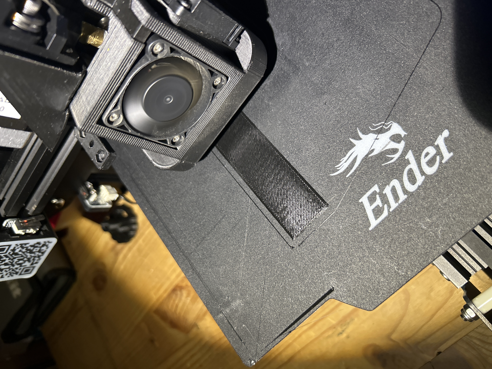

# PrusaSlicer Configs for Creality Ender 3 Pro with Direct Drive
> 🔎 Keywords: PrusaSlicer Profile, Creality Ender 3 Pro, Direct Drive, Polymaker PolyTerra PLA+, 3D Printing, Best Settings, Optimized Profiles

## Overview

This repository contains customized **PrusaSlicer 2.9.0** profiles for the **Creality Ender 3 Pro** with a **Direct Drive** modification. The profiles are specifically optimized for **Polymaker PolyTerra PLA+** filament, with separate configurations for **small** and **large** prints to ensure optimal results for various model sizes.

## Hardware Setup

The printer is equipped with the following modifications:

- **Printer:** Creality Ender 3 Pro
- **Direct Drive:** Custom Direct Drive conversion
- **Fan Mount:** [Thingiverse Link](https://www.thingiverse.com/thing:4369859)
- **BL-Touch Removed**: Manual bed leveling using the paper method

---

## Included Configurations

The provided profiles are optimized for **Polymaker PolyTerra PLA+** filament and differentiated for small and large prints:

| Profile               | Layer Height | Infill Density | Optimized For | Tested |
| --------------------- | ------------ | --------------- | --------------- | ------ |
| **0.20 mm Normal (LARGE)** | 0.20 mm      | 30%             | Large, stable models | ✅ |
| **0.20 mm Normal (SMALL)** | 0.20 mm      | 15%             | Small, detail-focused models | ✅ |

> **Note:** Both profiles have been tested extensively for quality and reliability.

---

## Optimizations & Key Features

### **First Layer Settings (Both Profiles):**
- First Layer Height: **0.24 mm** (LARGE) / **0.20 mm** (SMALL)
- First Layer Speed: **20 mm/s**
- First Layer Extrusion Width: **0.48 mm** (LARGE) / **0.45 mm** (SMALL)
- First Layer Temperature: **200°C**
- First Layer Bed Temperature: **65°C**

### **Retraction & Extrusion Settings:**
- Retraction Length: **1.3 mm** (LARGE) / **1.0 mm** (SMALL)
- Retraction Speed: **50 mm/s**
- Retraction Before Wipe: **20%** (LARGE) / **0.6%** (SMALL)
- Extrusion Multiplier: **1.01**
- Filament Diameter: **1.75 mm**
- Extrusion Width: **0.4 mm**

### **Additional Optimizations:**
- **Infill Density:**  
  - **30%** for LARGE profile to improve structural stability  
  - **15%** for SMALL profile to reduce material usage and printing time
- **Top Solid Layers:**  
  - **6** for LARGE prints to ensure strong, smooth top layers  
  - **5** for SMALL prints to optimize print speed
- **Start GCode Optimization:**  
  - Düse heizt erst auf **150°C**, dann auf Drucktemperatur → **Verhindert Filamentausfluss vor Druckbeginn**
  - **Erweiterte Reinigungslinien** für verbesserte Extrusionskontrolle
- **Seam Position:** Set to `Nearest` for reduced visible seams.

---

## Installation

### 1. Importing PrusaSlicer Profiles
1. Open **PrusaSlicer**.
2. Go to **Settings → Import Profiles** and select `PrusaSlicer_config_bundle-combi.ini`.
3. Select the desired profile depending on your print size:
   - **LARGE** for big, stable parts.
   - **SMALL** for smaller, detail-oriented prints.

---

## Tips for Best Results
✅ Use the **LARGE** profile for big models to ensure better stability and layer adhesion.  
✅ Use the **SMALL** profile for smaller parts where precision and detail are critical.  
✅ Both profiles are optimized to reduce **stringing** and **warping**, which were common issues in earlier configurations.  

---

## License

These configuration files are provided under the **MIT License**, meaning you are free to use, modify, and share them.

---

## Feedback & Improvements

If you have suggestions for improvements or find any issues, feel free to create an **issue** on GitHub or submit a **pull request** with your adjustments.

Enjoy smooth and reliable prints! 🚀
